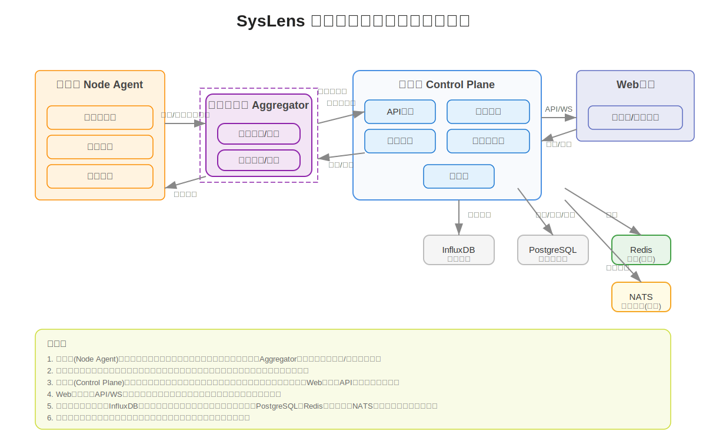

# SysLens 分布式服务器监控系统架构

## 系统概述

SysLens是一个分布式服务器监控系统，采用现代化的微服务架构设计，提供全面的服务器监控、数据采集、分析和可视化功能。系统由多个核心组件组成，每个组件负责特定的功能，共同协作完成监控任务。

## 系统架构图



## 核心组件

### 1. 控制平面 (Control Plane)

控制平面是系统的核心管理组件，负责整体协调和决策。

#### 主要功能

- 节点管理和注册
- 配置分发和管理
- 命令下发和执行
- WebSocket实时通信

#### 技术特点

- 基于WebSocket的实时双向通信
- 分布式配置管理
- 高可用性设计
- 安全认证和授权

### 2. 聚合服务器 (Aggregator Server)

聚合服务器负责数据的收集、处理和转发。

#### 主要功能

- 数据聚合和预处理
- 节点连接管理
- 数据流控制
- 控制平面客户端

#### 技术特点

- 高性能数据处理
- 可扩展的插件系统
- 数据压缩和优化
- 故障检测和恢复

### 3. 存储层 (Storage Layer)

存储层提供数据持久化和查询服务。

#### 主要功能

- 时序数据存储 (InfluxDB)
- 内存缓存
- 历史数据管理
- 数据备份和恢复

#### 技术特点

- 高性能时序数据库
- 数据压缩和归档
- 查询优化
- 数据生命周期管理

### 4. 节点代理 (Agent)

节点代理部署在被监控的服务器上，负责数据采集和上报。

#### 主要功能

- 系统指标采集
- 数据上报
- 配置接收
- 命令执行

#### 技术特点

- 低资源占用
- 可配置的采集策略
- 本地缓存
- 断线重连

### 5. API服务 (API Service)

API服务提供系统对外接口。

#### 主要功能

- RESTful API
- 指标查询
- 节点管理
- 安全认证

#### 技术特点

- 标准REST API
- JWT认证
- 请求限流
- API版本控制

### 6. 监控面板 (Dashboard)

监控面板提供可视化的监控界面。

#### 主要功能

- 实时监控
- 历史数据查询
- 告警管理
- 数据可视化

#### 技术特点

- 响应式设计
- 丰富的图表类型
- 自定义仪表盘
- 告警规则配置

## 数据流

### 1. 指标数据流

```
节点代理 -> 聚合服务器 -> 存储层
```

### 2. 控制流

```
控制平面 -> 节点代理
控制平面 -> 聚合服务器
```

### 3. 查询流

```
监控面板 -> API服务 -> 存储层
```

## 安全机制

### 1. 认证

- JWT token认证
- 双向TLS认证
- API密钥认证

### 2. 授权

- 基于角色的访问控制
- 细粒度的权限管理
- 操作审计

### 3. 数据安全

- 传输加密
- 数据加密存储
- 敏感信息保护

## 高可用设计

### 1. 组件冗余

- 控制平面集群
- 聚合服务器集群
- 存储层集群

### 2. 故障转移

- 自动故障检测
- 服务自动切换
- 数据同步机制

### 3. 负载均衡

- 请求分发
- 资源调度
- 性能优化

## 扩展性

### 1. 水平扩展

- 组件无状态设计
- 动态扩缩容
- 负载均衡

### 2. 功能扩展

- 插件化架构
- 自定义采集器
- 告警规则扩展

## 部署架构

### 1. 开发环境

- 单节点部署
- 本地开发工具
- 调试支持

### 2. 测试环境

- 多节点部署
- 自动化测试
- 性能测试

### 3. 生产环境

- 高可用集群
- 监控告警
- 运维工具

## 技术栈

### 1. 后端

- Go语言
- gRPC
- WebSocket
- InfluxDB

### 2. 前端

- React
- TypeScript
- Ant Design
- ECharts

### 3. 运维

- Docker
- Kubernetes
- Prometheus
- Grafana

## 性能指标

### 1. 系统性能

- 支持监控节点数: 1000+
- 数据采集延迟: <1s
- 查询响应时间: <100ms
- 系统可用性: 99.99%

### 2. 资源消耗

- CPU使用率: <30%
- 内存使用: <2GB/节点
- 网络带宽: <10Mbps/节点
- 存储空间: 可配置

## 监控指标

### 1. 系统指标

- CPU使用率
- 内存使用
- 磁盘IO
- 网络流量

### 2. 应用指标

- 请求延迟
- 错误率
- 并发连接数
- 业务指标

### 3. 自定义指标

- 支持自定义采集器
- 支持Prometheus格式
- 支持HTTP接口

## 告警机制

### 1. 告警规则

- 阈值告警
- 趋势告警
- 异常检测
- 组合告警

### 2. 告警通知

- 邮件通知
- 短信通知
- WebHook
- 自定义通知

### 3. 告警管理

- 告警级别
- 告警分组
- 告警抑制
- 告警恢复

## 未来规划

### 1. 功能增强

- AI异常检测
- 智能告警
- 预测分析
- 自动化运维

### 2. 性能优化

- 分布式追踪
- 性能分析
- 资源优化
- 查询优化

### 3. 生态集成

- 云平台集成
- 容器平台集成
- 日志系统集成
- 运维工具集成
